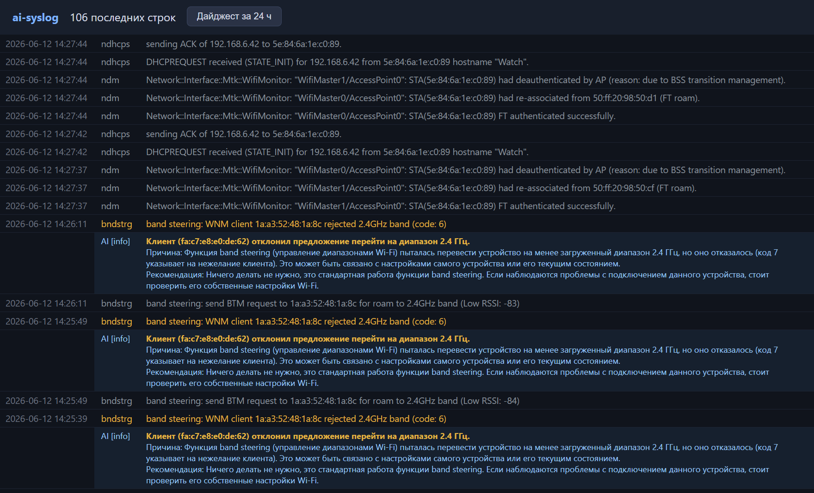

# ai-syslog

**AI-powered syslog server: every new error in your router's log gets an instant LLM-written explanation — root cause, severity, and what to do about it.**


[Русская версия](README.ru.md)



*A real WireGuard handshake failure, annotated by the AI in real time: severity, probable cause (ISP-level blocking vs. server downtime), and a concrete recommendation.*

## The idea

Routers and other network gear produce a constant stream of syslog messages. 95% of it is repetitive noise; the remaining 5% is cryptic one-liners like `curl response code: 403, content length: 17` that take real expertise to interpret. ai-syslog receives the raw stream, stores all of it, and asks an LLM to explain **only what's new and only what matters** — so you get expert-level annotations at a cost of well under $1/month.

## How it works

```
router ──UDP 514──▶ listener ──▶ SQLite (raw log, always, everything)
                                    │
                              Drain3 template mining
                                    │  only NEW templates with severity ≤ warning
                                    ▼
                              LLM triage (structured output: severity,
                              cause, recommendation, confidence)
                                    │
                                    ▼
                              FastAPI dashboard: live log with AI
                              annotations inline + daily AI digest
```

### Cost-aware by design

The naive approach — pipe every line through an LLM — burns money on repetition. Instead:

1. **Template mining (Drain3)**: 150 identical `403` errors collapse into one cluster.
2. **Severity gate**: only `warning` and worse get analyzed; DHCP chatter never reaches the LLM.
3. **Annotate once, display everywhere**: an annotation is attached to the *template*, so every matching line in the dashboard shows it for free.
4. **Two-tier models**: a cheap fast model for triage (≈$0.0003/call), a stronger one for the daily digest (≈$0.005/call).
5. **Mute list**: known-noise messages (Wi-Fi roaming, band steering, DHCP chatter) are filtered by regex patterns in [ignore_patterns.txt](ignore_patterns.txt) and never reach the LLM.

Real-world cost for a home router: **under $0.50/month**.

### Provider-agnostic

One small abstraction module ([app/llm.py](app/llm.py)) supports:

- **OpenRouter** (default: `google/gemini-2.5-flash-lite` for triage, `openai/gpt-5-mini` for digest)
- **Anthropic API** directly (`claude-haiku-4-5` / `claude-opus-4-8`)

Structured outputs are validated against a Pydantic schema in both cases — the annotation is always well-formed JSON, never free text to parse.

## Quick start

```bash
git clone https://github.com/ergon73/ai-syslog && cd ai-syslog
python -m venv .venv && .venv/Scripts/activate   # Windows; use bin/activate on Linux
pip install -r requirements.txt
cp .env.example .env                              # add your OPENROUTER_API_KEY
python main.py
```

Dashboard: http://127.0.0.1:8514. Without an API key the server still works — it collects logs and mines templates, LLM triage is simply off.

### Point your router at it

Keenetic (web UI): *Management → Diagnostics → System log → send to remote syslog server* → IP of the machine running ai-syslog. Or via CLI:

```
system log server <collector-ip>
system configuration save
```

Any device that speaks RFC 3164 syslog over UDP will work. On Windows, the firewall blocks inbound UDP 514 by default — run the one-time setup script (it self-elevates and is idempotent):

```powershell
powershell -ExecutionPolicy Bypass -File setup.ps1
```

This creates an inbound allow rule for UDP 514. Tighten it to your router's IP with `-RemoteAddress 192.168.6.1` if you like.

## Configuration

All via `.env` (see [.env.example](.env.example)):

| Variable | Default | Purpose |
|---|---|---|
| `OPENROUTER_API_KEY` / `ANTHROPIC_API_KEY` | — | LLM provider (OpenRouter wins if both set) |
| `TRIAGE_MODEL` | `google/gemini-2.5-flash-lite` | per-message analysis |
| `SYNTHESIS_MODEL` | `openai/gpt-5-mini` | daily digest |
| `DEVICE_PROFILE` | generic | description of your network, injected into the system prompt — the more specific, the better the analysis |
| `ANALYZE_SEVERITY_THRESHOLD` | `4` | analyze severity ≤ N (4 = warning and worse) |
| `SYSLOG_PORT` / `WEB_PORT` | `514` / `8514` | ports |

### Device identity enrichment — no LLM needed

- **Vendor by MAC**: resolved against a local copy of the IEEE OUI database (Wireshark `manuf`, auto-downloaded and refreshed monthly). Randomized (private) MACs are detected and labeled.
- **Name by MAC/IP**: the device-name map is **learned automatically from the router's own DHCP log lines** (`hostname "..."`) — zero config, no personal data in the repo. `IP → MAC → name` chains are resolved too. Optional `hosts.txt` (gitignored) lets you override names DHCP can't know, e.g. labeling a static IP as "the collector server".

Both feed the dashboard and the LLM context, so the analyzer says *"192.168.6.70 — the ai-syslog collector laptop"* instead of guessing *"probably a Smart TV"*.

## Roadmap

- [x] Noise filtering via regex mute list (`ignore_patterns.txt`)
- [x] MAC vendor enrichment from offline IEEE OUI database
- [x] Device naming auto-learned from DHCP logs (+ optional `hosts.txt` overrides)
- [ ] Backfill gaps via the router's REST API on startup (for collectors that aren't always on)
- [ ] Read-only diagnostics: let the analyzer query the router (interface states, routes) while investigating an error
- [ ] Tiered auto-remediation: whitelist of reversible, idempotent fixes with audit log and kill switch
- [ ] Scheduled daily digest + notifications (Telegram)
- [ ] Dockerfile / compose for NAS and single-board deployment

## License

MIT
